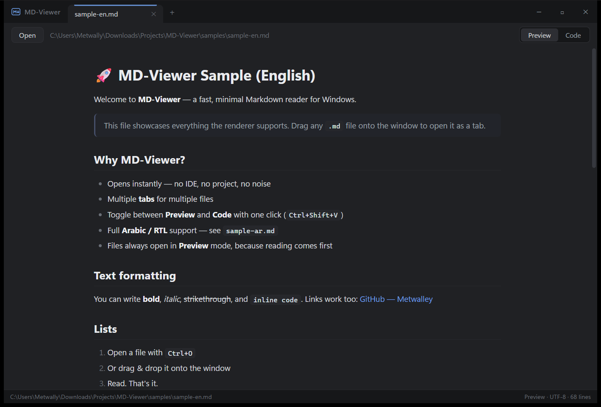
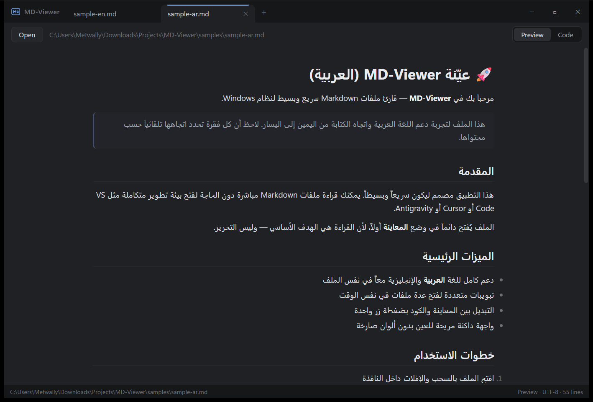

# MD-Viewer

A fast, minimal Markdown reader for Windows 11. No IDE, no project, no noise — just open and read.

<p align="center">
  
  
</p>

## Download

Grab the latest portable executable from the [Releases page](https://github.com/Metwalley/MD-Viewer/releases) — a single `.exe`, no installer, no setup. Just download and run.

> **SmartScreen note:** the exe is not code-signed, so Windows may show "Windows protected your PC" on first run. Click **More info → Run anyway**.

## Why

Every time you want to read a Markdown file you end up opening a full IDE. MD-Viewer starts instantly and gets out of your way. It is a **reader first**: files always open in **Preview** mode, and clicking around the preview never switches you into an editor.

## Features

- **Tabs** — open as many files as you want, side by side in tabs
- **Preview / Code toggle** — one click (or `Ctrl+Shift+V`) flips the active tab between rendered Markdown and its source, just like Cursor
- **Preview by default** — reading comes first; no accidental editing
- **Arabic + RTL support** — every paragraph auto-detects its direction, mixed Arabic/English documents render correctly (see `samples/sample-ar.md`)
- **Full Markdown** — tables, task lists, fenced code with syntax highlighting, blockquotes, strikethrough, raw HTML
- **Copy-friendly** — select any text, or hover a code block for a one-click **Copy** button
- **Encoding aware** — UTF-8, UTF-8 BOM, and legacy Arabic `Windows-1256` files are detected automatically
- **Drag & drop** — drop files (or select many at once in the open dialog) and each opens in its own tab
- **Single instance** — double-clicking more `.md` files adds tabs to the running window
- **Clean dark theme** — neutral, easy on the eyes, no neon
- **Tiny and fast** — a single ~3 MB executable using the native Windows WebView2 runtime

## Shortcuts

| Shortcut | Action |
|----------|--------|
| `Ctrl+O` | Open file |
| `Ctrl+W` | Close tab |
| `Ctrl+Tab` / `Ctrl+Shift+Tab` | Next / previous tab |
| `Ctrl+Shift+V` | Toggle Preview / Code |
| `Ctrl+S` | Save (after editing in Code view) |
| Middle-click | Close a tab |

## Open .md files with a double-click

1. Right-click any `.md` file → **Open with** → **Choose another app**
2. Browse to `MD-Viewer.exe` and select it
3. Tick **Always**

Every `.md` file you double-click then opens as a new tab in the same window.

## Build from source

Requires [Rust](https://rustup.rs), Node.js, and the [WebView2 runtime](https://developer.microsoft.com/microsoft-edge/webview2/) (preinstalled on Windows 11).

```powershell
npm install
npm run tauri build
```

The executable lands at `src-tauri/target/release/md-viewer.exe`.

## License

[MIT](LICENSE)
